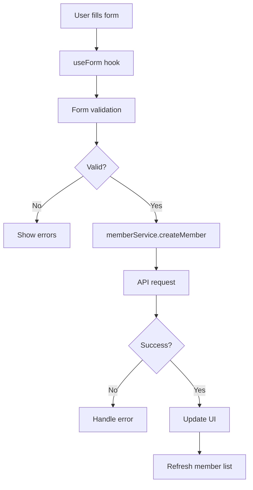
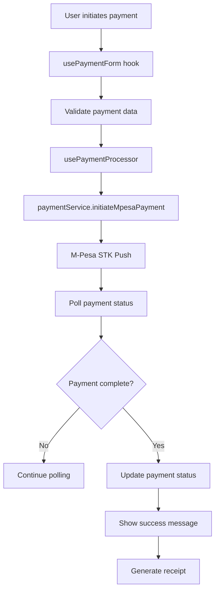

# Frontend Architecture Refactoring Guide

## 🏗️ Project Overview

This document outlines the comprehensive refactoring of the frontend codebase to implement a clean, maintainable architecture following modern React patterns and best practices.

## 📋 Table of Contents

- [Architectural Principles](#architectural-principles)
- [Project Structure](#project-structure)
- [What Was Refactored](#what-was-refactored)
- [Data Flow Architecture](#data-flow-architecture)
- [Development Workflows](#development-workflows)
- [Adding New Features](#adding-new-features)
- [File Organization](#file-organization)

## 🎯 Architectural Principles

The refactoring follows these core principles:

### **Separation of Concerns**
- **API Logic** → Services (`services/`)
- **Form Logic** → Custom Hooks (`hooks/`)
- **UI Logic** → Components (`components/`)
- **Validation** → Utilities (`utils/`)

### **Component Hierarchy**
```
Pages (Route-level components)
  ↓
Components (Reusable UI components)  
  ↓
Hooks (Business logic & state management)
  ↓
Services (API communication)
  ↓
Utils (Pure functions & validation)
```

### **Data Flow Pattern**
```
User Interaction → Hook → Service → API
                    ↓
UI Update ← Component ← Hook ← Response
```

## 📁 Project Structure

```
frontend/src/
├── components/          # Reusable UI components
│   ├── forms/          # Form components
│   ├── ui/             # Basic UI elements
│   └── common/         # Shared components
├── pages/              # Route-level components
├── hooks/              # Custom hooks for business logic
│   ├── useApi.js       # Generic data fetching
│   ├── useForm.js      # Form management
│   ├── useAuth.js      # Authentication
│   └── usePayments.js  # Payment-specific hooks
├── services/           # API communication layer
│   ├── authService.js
│   ├── memberService.js
│   ├── paymentService.js
│   └── membershipService.js
├── utils/              # Pure functions & utilities
│   ├── formatters.js   # Data formatting
│   └── validation.js   # Form validation
├── contexts/           # React contexts
└── config/            # Configuration files
```

## 🔄 What Was Refactored

### **1. Member Management System**

#### **Before:**
```javascript
// Direct API calls in components
const fetchMembers = async () => {
  try {
    const response = await axios.get('/api/members');
    setMembers(response.data);
  } catch (error) {
    setError(error.message);
  }
};

// Form validation in component
const validateForm = () => {
  const errors = {};
  if (!formData.firstName) errors.firstName = 'Required';
  // ... more validation
  return errors;
};
```

#### **After:**
```javascript
// Using custom hooks
const {
  members,
  loading,
  error,
  refreshAll
} = useMembers(queryParams);

const {
  createMember,
  updateMember,
  deleteMember
} = useMemberMutations(refreshAll);

// Form with validation hook
const {
  values,
  errors,
  handleChange,
  handleSubmit
} = useForm(initialValues, validationSchema, onSubmit);
```

### **2. Payment System**

#### **Before:**
```javascript
// Complex state management in PaymentForm
const [paymentData, setPaymentData] = useState({...});
const [isProcessing, setIsProcessing] = useState(false);
const [paymentStatus, setPaymentStatus] = useState(null);

// Inline payment processing
const handleMpesaPayment = async () => {
  // 100+ lines of payment logic
};
```

#### **After:**
```javascript
// Clean hook-based approach
const {
  formData,
  errors,
  paymentStatus,
  isProcessing,
  handleMpesaPayment,
  handleManualPayment
} = usePaymentForm(member, onSuccess);
```

### **3. API Services**

#### **Before:**
```javascript
// Mixed concerns in authService
const authService = {
  login,
  register,
  getMembers,        // Should be in memberService
  createMember,      // Should be in memberService
  processPayment     // Should be in paymentService
};
```

#### **After:**
```javascript
// Focused services
const memberService = {
  getMembers,
  createMember,
  updateMember,
  deleteMember,
  searchMembers,
  exportMembers
};

const paymentService = {
  initiateMpesaPayment,
  recordManualPayment,
  getPaymentHistory,
  sendPaymentReminder
};
```

## 🔄 Data Flow Architecture

### **Member Registration Flow**



### **Payment Processing Flow**



## 🛠️ Development Workflows

### **1. Adding a New Form Component**

#### **Step 1: Create validation schema**
```javascript
// utils/validation.js
export const newFormValidationSchema = {
  field1: [validationRules.required],
  field2: [validationRules.email],
  field3: [validationRules.minLength(5)]
};
```

#### **Step 2: Create form component**
```javascript
// components/forms/NewForm.jsx
import { useForm } from '../../hooks/useForm';
import { newFormValidationSchema } from '../../utils/validation';

const NewForm = ({ onSubmit, onCancel }) => {
  const {
    values,
    errors,
    isSubmitting,
    handleChange,
    handleSubmit
  } = useForm(initialValues, newFormValidationSchema, onSubmit);

  return (
    <form onSubmit={handleSubmit}>
      {/* Form fields */}
    </form>
  );
};
```

### **2. Adding a New API Endpoint**

#### **Step 1: Add to service**
```javascript
// services/memberService.js
export const memberService = {
  // existing methods...
  
  newEndpoint: async (params) => {
    try {
      const response = await apiClient.post('/new-endpoint', params);
      return response.data;
    } catch (error) {
      throw new Error(error.response?.data?.message || 'Operation failed');
    }
  }
};
```

#### **Step 2: Create custom hook (if needed)**
```javascript
// hooks/useApi.js
export const useNewFeature = (params) => {
  return useApi(
    () => memberService.newEndpoint(params),
    [params]
  );
};
```

#### **Step 3: Use in component**
```javascript
// components/NewComponent.jsx
import { useNewFeature } from '../hooks/useApi';

const NewComponent = () => {
  const { data, loading, error } = useNewFeature(params);
  
  if (loading) return <div>Loading...</div>;
  if (error) return <div>Error: {error}</div>;
  
  return <div>{/* Render data */}</div>;
};
```

### **3. Adding a New Page**

#### **Step 1: Create page component**
```javascript
// pages/NewPage/index.jsx
import { useNewFeature } from '../../hooks/useApi';
import Header from '../../components/common/Header';
import Sidebar from '../../components/common/Sidebar';

const NewPage = () => {
  const { data, loading, error } = useNewFeature();
  
  return (
    <div className="flex h-screen bg-gray-50">
      <Sidebar />
      <div className="flex-1 flex flex-col overflow-hidden">
        <Header />
        <main className="flex-1 overflow-y-auto p-6">
          {/* Page content */}
        </main>
      </div>
    </div>
  );
};

export default NewPage;
```

#### **Step 2: Add route**
```javascript
// Routes.jsx
import NewPage from './pages/NewPage';

const Routes = () => (
  <Routes>
    <Route path="/new-page" element={<NewPage />} />
    {/* Other routes */}
  </Routes>
);
```

## ✨ Adding New Features

### **Payment Method Integration**

Want to add a new payment method? Here's how:

#### **1. Update Payment Service**
```javascript
// services/paymentService.js
export const paymentService = {
  // existing methods...
  
  initiateCardPayment: async (paymentData) => {
    try {
      const response = await apiClient.post('/payments/card/initiate/', paymentData);
      return response.data;
    } catch (error) {
      throw new Error(error.response?.data?.message || 'Card payment failed');
    }
  }
};
```

#### **2. Update Payment Hook**
```javascript
// hooks/usePayments.js
export const usePaymentProcessor = () => {
  // existing code...
  
  const processCardPayment = useApiMutation(
    paymentService.initiateCardPayment,
    {
      onSuccess: (result) => {
        setPaymentStatus('completed');
      }
    }
  );
  
  return {
    // existing returns...
    processCardPayment
  };
};
```

#### **3. Update Payment Form**
```javascript
// components/forms/PaymentForm.jsx
const PaymentForm = ({ member, onSuccess }) => {
  const {
    // existing hooks...
    processCardPayment
  } = usePaymentForm(member, onSuccess);
  
  const handleCardPayment = async () => {
    // Card payment logic
  };
  
  return (
    <div>
      {/* existing form */}
      <Button onClick={handleCardPayment}>
        Pay with Card
      </Button>
    </div>
  );
};
```

### **Adding New Member Fields**

#### **1. Update Validation Schema**
```javascript
// utils/validation.js
export const memberValidationSchema = {
  // existing fields...
  newField: [validationRules.required, validationRules.minLength(3)]
};
```

#### **2. Update Service**
```javascript
// services/memberService.js - No changes needed if API supports it
```

#### **3. Update Form**
```javascript
// components/forms/RegisterMemberForm.jsx
const RegisterMemberForm = ({ onSubmit }) => {
  const initialValues = {
    // existing fields...
    newField: ''
  };
  
  // Form will automatically handle the new field
  return (
    <form>
      {/* existing fields */}
      <input
        name="newField"
        value={values.newField}
        onChange={handleChange}
      />
      {errors.newField && <span>{errors.newField}</span>}
    </form>
  );
};
```

## 📂 File Organization Guidelines

### **When to Create New Files**

#### **New Service File:**
```javascript
// When adding a completely new domain (e.g., inventory, reports)
// services/inventoryService.js
export const inventoryService = {
  getItems,
  createItem,
  updateStock
};
```

#### **New Hook File:**
```javascript
// When adding complex domain-specific logic
// hooks/useInventory.js
export const useInventory = () => {
  // Complex inventory management logic
};
```

#### **New Utility File:**
```javascript
// When adding domain-specific utilities
// utils/inventoryUtils.js
export const calculateStockValue = (items) => {
  // Utility functions
};
```

### **File Naming Conventions**

- **Components**: PascalCase (`PaymentForm.jsx`)
- **Hooks**: camelCase with 'use' prefix (`usePayments.js`)
- **Services**: camelCase with 'Service' suffix (`memberService.js`)
- **Utils**: camelCase (`validation.js`)
- **Pages**: PascalCase in folders (`Members/index.jsx`)

## 🚀 Benefits Achieved

### **Developer Experience**
- ✅ **Faster Development**: Reusable hooks and services
- ✅ **Easier Testing**: Separated concerns make unit testing simple
- ✅ **Better Debugging**: Clear data flow makes issues easier to trace
- ✅ **Code Reusability**: Hooks can be shared across components

### **Maintainability**
- ✅ **Single Responsibility**: Each file has one purpose
- ✅ **Predictable Structure**: Consistent patterns across the app
- ✅ **Easy Refactoring**: Changes isolated to specific layers
- ✅ **Documentation**: Clear interfaces and error handling

### **Performance**
- ✅ **Optimized Re-renders**: Proper state management
- ✅ **Efficient Data Fetching**: Built-in caching and error handling
- ✅ **Debounced Operations**: Search and form submissions

## 🔧 Troubleshooting

### **Common Issues**

#### **Hook Dependencies**
```javascript
// ❌ Wrong - missing dependencies
useEffect(() => {
  fetchData();
}, []);

// ✅ Correct - include all dependencies
useEffect(() => {
  fetchData();
}, [fetchData, param1, param2]);
```

#### **Error Handling**
```javascript
// ✅ Always handle errors in services
try {
  const response = await apiClient.get('/endpoint');
  return response.data;
} catch (error) {
  throw new Error(error.response?.data?.message || 'Operation failed');
}
```

#### **State Updates**
```javascript
// ✅ Use functional updates for state based on previous state
setItems(prevItems => [...prevItems, newItem]);
```

## 📈 Future Improvements

### **Planned Enhancements**
1. **Type Safety**: Migrate to TypeScript
2. **Testing**: Add comprehensive test coverage
3. **Performance**: Implement virtual scrolling for large lists
4. **Offline Support**: Add service worker for offline functionality
5. **Real-time Updates**: WebSocket integration for live data

### **Architecture Evolution**
- **State Management**: Consider Zustand/Redux for complex global state
- **Code Splitting**: Implement route-based code splitting
- **Bundle Optimization**: Tree shaking and dynamic imports
- **Error Boundaries**: Add comprehensive error handling

---

## 📞 Support

For questions about this architecture or implementing new features:

1. Check this documentation first
2. Look at existing similar implementations
3. Follow the established patterns
4. Maintain separation of concerns

Remember: **Keep components simple, push logic to hooks, and make services focused!**